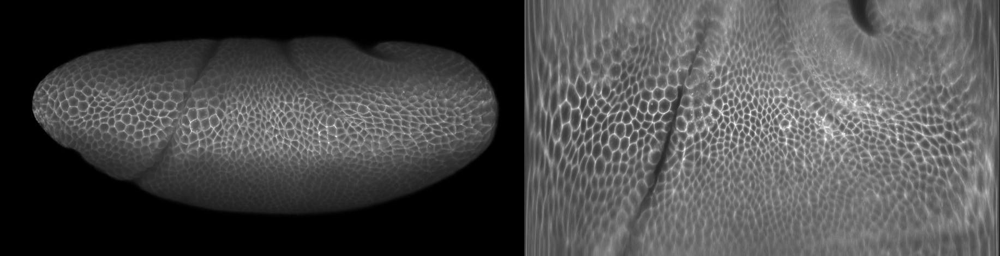

# How to make cartographic projections using ImSAnE

The tutorial shows how to generate map projections of imaging data using the [ImSAnE Toolbox](https://github.com/idse/imsane).
This repository hosts only scripts and text files; images and videos aren’t included.
For the fully-featured, nicely-rendered tutorial, please download it from Zenodo:

Vellutini, Bruno C. (2022). How to make cartographic projections using ImSAnE. Zenodo. https://doi.org/10.5281/zenodo.7628300

