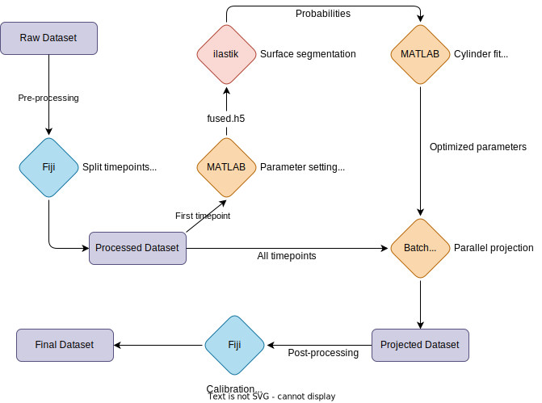

## Summary {#sec-summary}

This tutorial shows how to make cartographic projections of fly embryos using the ImSAnE Toolbox [@Heemskerk2015-kv].
The pipeline was developed by Akanksha Jain, Vladimir Ulman, and collaborators for the *Tribolium* paper [@Jain2020-yl].
I made some tweaks to the workflow and created scripts for batch-generating projections.

<!--TODO: Add images of cartographic projections as examples-->

{#fig-flowchart width=100%}

## Requirements {#sec-requirements}

* **[ImSAnE](https://github.com/idse/imsane)** [@Heemskerk2015-kv]: LoPaTs modified version with onion layers.
* **[MATLAB](https://www.mathworks.com/products/matlab.html)** [@Matlab2015-nd]: Version R2015b with active license.
* **[ilastik](https://www.ilastik.org/)** [@Berg2019-ab]: Version 1.3.3b2.
* **[ImSAnE-Fiji](https://github.com/xulman/TomancakLab)** [@Jain2020-yl]: Scripts to export data and images from ImSAnE.
* **[Fiji/ImageJ](https://fiji.sc/)** [@Schindelin2012-di]: For processing and inspecting image stacks.

## Setup {#sec-setup}

What we need before starting:

- Software above installed and ready to use
- An imaging dataset split by timepoints
- The following directory outline:

```
template/
├── fused
├── imsane
├── logs
├── raw
├── scripts
├── stacks
│   └── cylinder1
├── batch_gen.sh
├── batch_submit.sh
├── MyProject.ilp
└── TutorialIlastikDetectorSpherelikeFitter.m
```

### Create directories {#sec-mkdirs}

You can simply copy the provided [`template`](template/) folder or follow these steps to create the necessary directories.

- Create empty directory using dataset name.
- Copy `batch_gen.sh`, `batch_submit.sh`, `MyProject.ilp`, and `TutorialIlastikDetectorSpherelikeFitter.m` to empty directory
- Create the subdirectories `raw`, `fused`, `imsane`, `logs`, `scripts`, and `stacks`.

{#fig-mkdirs}

:::{.callout-tip}

You can use the script [`mkdirs.sh`](scripts/mkdirs.sh) to generate the folder organization above with your dataset name. 

:::

### Split timepoints {#sec-split}

ImSAnE generates cartographic projections for a single timepoint.
If you have a timelapse, you need to split the timepoints to individual files.
You can do it with an ImageJ macro that iterates over a virtual stack and re-saves individual timepoints to an output folder.

- Open full dataset as virtual stack in Fiji.
- Load the macro [`SplitTimepoints.ijm`](scripts/SplitTimepoints.ijm).
- If your dataset is multiview and already fused, save the output to the `fused` folder, otherwise choose the folder `raw` and wait.

{#fig-split}

:::{.callout-note}

Make sure the calibration (pixel resolutions) are properly saved to the individual timepoints.

:::

### Mirror dataset {#sec-mirror}

ImSAnE needs a cylinder-like embryo to properly work.
This is not the case for single view datasets which generally only cover half of the embryo.
A trick to trick ImSAnE is to mirror your dataset, making it a “full” embryo, and then un-mirroring it afterwards.

<!--TODO: Add example images for half embryos-->

I mirror my datasets with the help of a couple of macros.
The reason is that ImSAnE needs an almost perfectly round embryo in transversal section.
But sometimes the Z-stack captures less (or more) than half of the embryo, making the mirror image become oblong in transversal section.
Here’s how to fine tune individual embryos to avoid future problems with ImSAnE’s cylinder fitting.

- Open a single timepoint in Fiji and run the macro [`MirrorFlyEmbryosTest.ijm`](scripts/MirrorFlyEmbryosTest.ijm).
- When the resliced window appears, hold shift and try to fit the circle to the transverse section of the embryo.
- If the section is less than a circle, you need to add slices. If it’s more than a circle, you need to remove slices. This is controlled by the `sfactor` value in the macro.
- Close the resliced windows, adjust the `sfactor`, and run the macro again.
- Check the transverse section fitting to the circle ROI.
- If you achieve perfect roundness, close all images, set the same `sfactor` to the macro [`MirrorFlyEmbryosBatch.ijm`](scripts/MirrorFlyEmbryosBatch.ijm), and run it.
- Choose `raw` as INPUT directory and `fused` as OUTPUT directory.
- By the end of the macro, the `fused` folder will contain the individual timepoints with mirrored embryos.

{#fig-mirror}

## Optimize projection {#sec-optimize}

We first want to adjust the parameters of ImSAnE using a single timepoint.
In summary, we will load the first timepoint into MATLAB, segment the embryo’s surface in ilastik, fit a cylinder to the surface in MATLAB, and project this surface, and the onion layers above and below, into 2D images.
After we optimize the projection for the first timepoint, we can batch generate them for remaining timepoints (see @sec-batch).

### Compile ImSAnE {#sec-compile}

Before beginning, we need to compile ImSAnE’s code.

- Start MATLAB and load the file [`setup.m`](source/imsane_min_Sebastian/setup.m) located in the [`imsane_min_Sebastian`](source/imsane_min_Sebastian) folder.
- Click `Run and Advance` to run each individual section.
- The `compile_mex` section will give a warning. Don't panic, it'll compile successfully in a couple of minutes.
- After that don't forget to run the last section.

{#fig-compile}

### Load dataset {#sec-load}

Next, we set the dataset parameters in the fitter file, and load the data. 

- Open the file [`TutorialIlastikDetectorSpherelikeFitter.m`](scripts/TutorialIlastikDetectorSpherelikeFitter.m) in MATLAB and edit the variables and parameters to match your dataset.
- **Filename**. Update filename string replacing the timepoint by `%0d`.
- **Timepoints**. Update the number of timepoints.
- **Calibration**. Update pixel resolution for XYZ. To find out, open one timepoint in Fiji and check the image properties with CTRL+SHIFT+P.
- Now go to the first section and `Run and Advance` until (including) the section `xp.detector.prepareIlastik(xp.stack)`.
- This will save the parameters, load the first timepoint, and generate a `fused.h5` file inside the `fused` directory.

{#fig-load}

### Segment surface {#sec-segment}

- Start ilastik and open `Create New Project` > `Pixel Classification` and select the `MyProject.ilp` on the dataset directory as project name (overlap it).
- Then load the `fused.h5` file by clicking on `Raw Data` > `Add New` > `Add Separate Images(s)...` and selecting `fused.h5`.
- Go to `2. Feature Selection` > `Select Features` and select all boxes.
- Go to `3. Training`. The `Label 1` is the background channel and the `Label 2` is the foreground channel.
- The goal is to detect the surface of the embryo.
- Begin with cross section and mark the membrane region as foreground (blue). Mark the background (black) and yolk as background (yellow).
- Paint the structures first in Y. Make sure the edges are well delimited and press Live Update.
- You should see the prediction. Fix areas of uncertainty in the three views X, Y and Z.
- When the segmentation looks good, go to 4. Prediction Export and click Export All.
- This will create the file fused_Probabilities.h in the fused directory.
- Save the project but keep ilastik open in case it needs to be modified.
- Take care of sampling some diversity
- Note: in case the datasets are really similar, one can use `run_ilastik.sh` to automatically generate probabilities.

{#fig-segment}

### Fit cylinder {#sec-cylinder}

- Go back to MATLAB and `Run and Advance` on the `xp.detectSurface()` section.
- Run the subsequent block to show the point cloud in a cross section. The points should be distributed along the embryo’s surface.
- The next block will show the point cloud in 3D. Check if there are any irregularities distorting the surface (for example, sometimes there’s dirt on the vitelline which makes a bump).
- If all looks good, continue to the fitting steps. It’s a two-step process, a coarse and a fine fit. `Run and Advance` and inspect the red line fit in a cross section. It doesn’t need to be exactly over the embryo’s surface, it can be slightly below or above, as long as it is perfectly round and match the circumference of the embryo. If the red line looks distorted or squeezed, the fitting is suboptimal. See how to debug below.
- The next block sets which desired charts to generate. The description for each type of projection is on the file. If none is specified, it’ll generate a `cylinder1_index`.
- Next, we have to define the `onionOpts`. It specifies how many onion layers to pull back below and above the current cylinder fit (red line). I use 90 slices to the inside (`nLayersP`) and 10 slices to the outside (`nLayersM`) with a distance of 4 pixels between them (101 slices in total).
- Running this block will begin the pull back of onion layers for the first timepoint. It takes a while (~5 min).
- After that, run the next block to save these pulled back surfaces to disk as TIFF files. This also takes a while but then you are done, for now.

{#fig-cylinder}

How to debug the cylinder fit:

- The first parameter I change is the `thresh` value in `myDetectOpts`. This defines the threshold cut off for the point cloud probabilities. Higher-values include lower-quality points. Changing to a lower value will only use higher-probability points. This has a great impact on the surface fitting outcome. To test, update the value in `myDetectOpts` and run the block again, skip the `prepareIlastik` step, and go directly to the detect surface.
- Other parameters in `myDetectOpts`, values in two-step `fitOptions`.

### Check projection {#sec-check}

- To visualize the projection we need Fiji and Vlado's ImSAnE-Fiji repository.
- Open the `ImSAnE-Fiji-master` folder and the `1_exportFromImSAnE` subfolder, and load the macro [`2_createSequenceOfStacks.py`](source/ImSAnE-Fiji-master/1_exportFromImSAnE/2_createSequenceOfStacks.py) into Fiji.
- Run the macro and a dialog will open. Edit the absolute paths to the `data_layer_m10` and `data_layer_p90`, set the desired chart as `cylinder1_index/cylinder1` (change if needed), and edit the absolute path to the output directory `stacks/cylinder1` (make sure the directory exists).
- Update the first and last timepoint to `1` and run.
- It’s quick. Once it's done go to `stacks/cylinder1` and open the stack in Fiji.
- Auto-adjust brightness/contrast and set the voxel depth to `4` in the image properties (CTRL+SHIFT+P) to inspect how the cartographic projection looks. Tip: open orthogonal views (CTRL+SHIFT+H) and check if the surface is (mostly) straight.

{#fig-check}

## Batch projections {#sec-batch}

Now that the parameters for the cartographic projection are optimized for one timepoint, we need to generate the projections for the remaining timepoints.
You can make them directly in MATLAB.
There’s a block that loops over all the timepoints.
It’s easy to run and will work if you don’t have many timepoints.
But if you have more than twenty, it starts to become an issue.
The single loop takes too long and the computer often runs out of memory.
When this happens, restarting the process is manual and painful, you need to go through the MATLAB steps again to resume the loop.
To avoid some of this pain, I made scripts that submit small batches of 10 timepoints in parallel.
This solves most of the out-of-memory issues while still using the workstations’s full capacity to generate the projections faster.

### Submit parallel jobs {#sec-parallel}

- The two scripts for parallel processing are `batch_gen.sh` and `batch_submit.sh`.
- [`batch_gen.sh`](scripts/batch_gen.sh) will generate individual MATLAB files with a stripped down version of `TutorialIlastikDetectorSpherelikeFitter.m` designed to generate projections for a small batch of timepoints (default is ten timepoints).
- Before running `batch_gen.sh`, you need to update the script’s parameters to reflect your current dataset, such as the filename and pixel resolution.
- Importantly, if you made any changes to the MATLAB script (for example, adjusting fitting parameters), you need to update these values in the `batch_gen.sh`.
- I find that three parallel jobs with ten timepoints each submitted every 50 min works well for desktop workstations with ~100GB RAM, but this can be customized.
- To run, open a terminal in the dataset folder and type `bash batch_gen.sh <timepoints>` replacing `<timepoints>` by the actual number of timepoints. There’s also an alternative way to submit, check below.
- `batch_gen.sh` puts the MATLAB scripts into the `scripts` folder and creates a `batch_submit.sh` file in the root folder.
- Check the `batch_submit.sh` file and run it with `bash batch_submit.sh` on a terminal. Nothing will appear in the screen, just leave it running.
- Meanwhile, check the `logs` folder and the running processes with the `Monitor` app to make sure everything is going correctly.

{#fig-batch}

- Instead of running `batch_submit.sh`, I often copy and paste its contents to a terminal to run individual jobs directly.
- This is useful if you just want to submit a specific batch, or just want a more granular way to submit and follow-up the jobs.

{#fig-altbatch}

### Inspect logs {#sec-logs}

- Generating 150 timepoints can easily take more than twelve hours.
- Once the scripts are done, you need to check the logs to see if any of the jobs failed.
- Unfortunately this happens, and you may need to re-run a specific batch or single timepoint manually to complete the process.
- An easy way to check the logs is to run `tail -n 5 logs/*`. This will show the last five lines of each MATLAB batch script.
- They should end with a series of `>> >>`. If not, something went wrong and the job needs to be re-run. The exception is the log file ending with the message `Index exceeds matrix dimensions.` which is normal (it’s just the last script graciously failing).

{#fig-logs}

### Export stacks {#sec-export}

- Once all the timepoints have been successfully projected, one needs to make the individual stacks.
- Use Vlado's script `2_createSequenceOfStacks.py` in the same way as before (see @sec-check), but now update the first and last timepoint to reflect the full dataset.
- Running it will generate the projection stacks inside the `stacks/cylinder1` directory after a while. It doesn’t take super long but it isn’t quick either.

{#fig-export}

### Check stacks {#sec-stacks}

- Now it’s time to check the whole projected dataset.
- Import the stacks as virtual image sequence in Fiji with `File` > `Import` > `Image Sequence`.
- Convert to hyperstack with `Image` > `Hyperstacks` > `Stack to Hyperstack` setting slices to `101` and frames to the actual number of timepoints.
- Adjust contrast and Z resolution to get the pixel proportions right.
- Finally, inspect the dataset in time and in orthogonal views.

{#fig-stacks}

## Post-processing {#sec-post}

You have successfully generated cartographic projections for your dataset.
Congratulations!
Now there are only a few post-processing steps to wrap up this tutorial.

### Export coordinates {#sec-coordinates}

- The XY resolution in cartographic projections varies depending on the position. The edges of the images are more distorted than the center. If you want to measure something, the measurements need to corrected. For that we need the matrix file with the pixel resolution for each image coordinate. Vlado’s scripts are here to save us again.
- To export the projection coordinates with pixel resolutions, go to `ImSAnE-Fiji-master` and open the file [`1_exportImSAnE_forFiji.m`](source/ImSAnE-Fiji-master/1_exportFromImSAnE/1_exportImSAnE_forFiji.m) in MATLAB.
- Update the original XY pixel resolution of your dataset.
- Then, change the current folder in MATLAB to the directory where the `SOI.xml` is; that’s in `imsane/embryo`.
- Now `Run and Advance` which takes a while.
- When done, run the following blocks. They’ll ask where to save the output (I just select the same `imsane/embryo` directory), and will generate a few files containing the projection calibrations.

{#fig-coordinates}

### Re-save projections {#sec-resave}

* Before visualization and analyzes, it’s helpful to adjust the contrast and Z resolution for the individual cartographic projections, and crop if needed.
* For that I use the macro [`ResaveStacks.ijm`](scripts/ResaveStacks.ijm) or the macro [`Unmirror.ijm`](scripts/Unmirror.ijm). Load one of them into Fiji.
- Then open a single `stacks/cylinder1` timepoint in Fiji. Choose a late timepoint to be able to tell the embryo orientation.
* Edit the `indir` and `outdir` to match the full path to the `stacks/cylinder1` and to the `stacks/crop1` directories, respectively. You can choose any other name or location.
- The script will set the voxel depth to `4` by default.
- If the original dataset was mirrored (see @sec-mirror), it should be unmirrored by cropping. I use the macro recorder to select the area to be cropped. Note that ImSAnE leaves a 1 px padding on each margin (I like to crop it out).
- You can also remove top and bottom slices if they are too many, or are uninformative, by editing the command `Slice Keeper`. Use the orthogonal views to identify which slices can be discarded.
- Finally, flip the image if needed to orient the embryo and set the desired min/max contrast levels.
* Close the opened stack and run the macro. The processed stacks will be saved to the output directory in a few minutes.

{#fig-resave}

## References

::: {#refs}
:::
